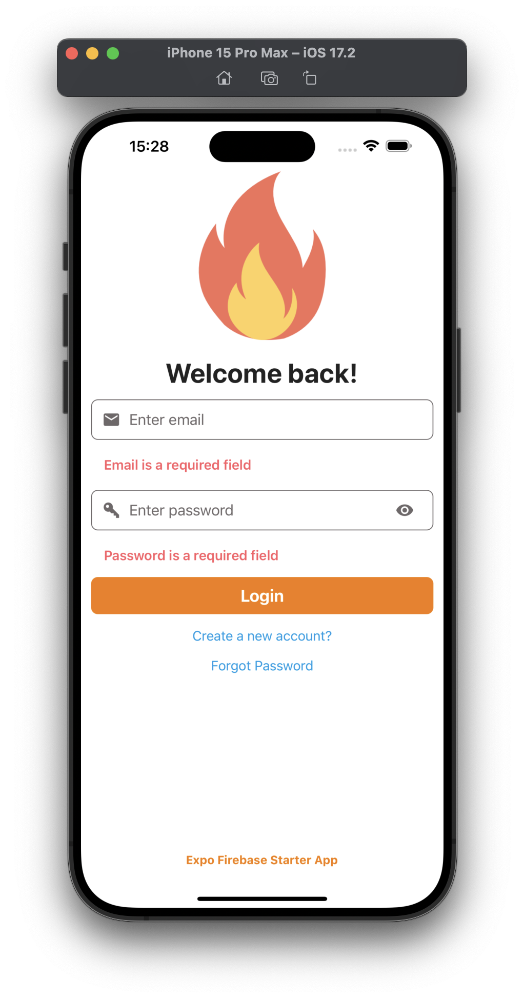
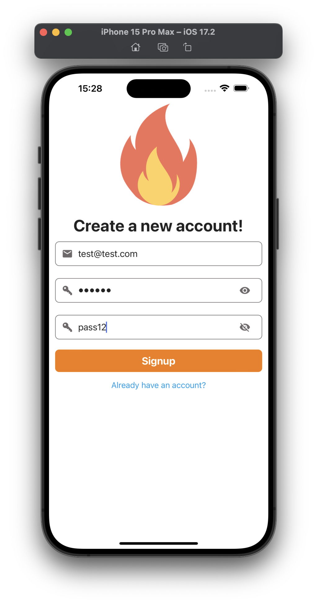
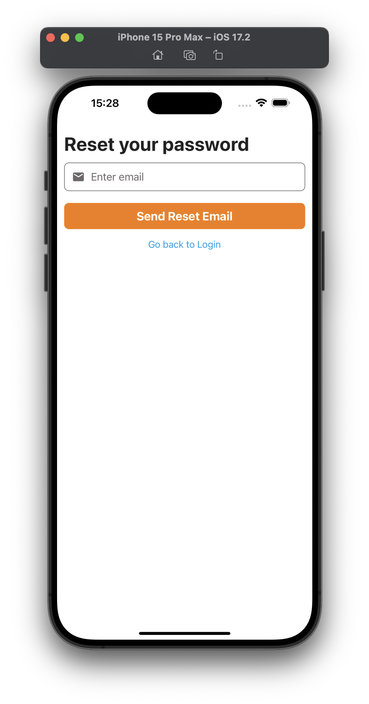
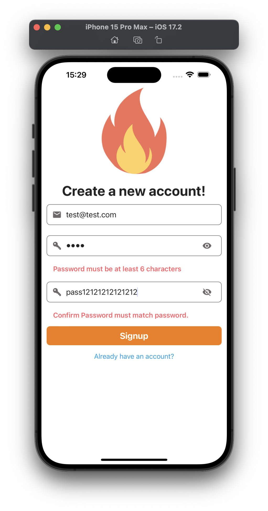

# expo-firebase-starter 🔥

> [!CAUTION]
> This repository is archived and no longer maintained. For up-to-date examples, check out [expo/examples](https://github.com/expo/examples) or create a project from an example by running `bun create expo --example` in your terminal.


[](https://expo.dev/client)

Is a quicker way to start with Expo + Firebase (using JS SDK) projects. It includes:

- based on Expo SDK `50`
- navigation using `react-navigation` 6.x.x
- Firebase JS SDK v9
- Firebase as the backend for email auth
- custom and reusable components
- custom hook to toggle password field visibility on a TextInput
- handles server errors using Formik
- Login, Signup & Password Reset form built using Formik & yup
- show/hide the Password Field's visibility 👁
- uses a custom Provider using Context API & Firebase's `onAuthStateChanged` handler to check the user's auth state with
- handles Forgot Password Reset using the Firebase email method
- uses [Expo Vector Icons](https://icons.expo.fyi/)
- uses [KeyboardAwareScrollView](https://github.com/APSL/react-native-keyboard-aware-scroll-view) package to handle keyboard appearance and automatically scrolls to focused TextInput
- uses `dotenv` and `expo-constants` packages to manage environment variables (so that they are not exposed on public repositories)
- all components are now functional components and use [React Hooks](https://reactjs.org/docs/hooks-intro.html)

## Installation

1. Create a new project using the firebase starter template.

```bash
npx create-react-native-app --template https://github.com/expo-community/expo-firebase-starter
```

2. Rename the file `example.env` to `.env`
3. Update `.env` with your own configuration, e.g.:

```shell
# Rename this file to ".env" before use
# Replace XXXX's with your own Firebase config keys
API_KEY=XXXX
AUTH_DOMAIN=XXXX
PROJECT_ID=XXXX
STORAGE_BUCKET=XXXX
MESSAGING_SENDER_ID=XXXX
APP_ID=XXXX
```

## Run project

To start the development server and run your project:

```
npx expo start
```

Alternate to using Expo Go, if you are building more than a hobby project or a prototype, make sure you [create a development build](https://docs.expo.dev/develop/development-builds/introduction/). You can either [locally compile your project](https://docs.expo.dev/guides/local-app-development/#local-builds-with-expo-dev-client) or [use EAS](https://docs.expo.dev/develop/development-builds/create-a-build/).

To locally compile your app, run:

```
# Build native Android project
npx expo run:android

# Build native iOS project
npx expo run:ios
```

## File Structure

```shell
Expo Firebase Starter
├── assets ➡️ All static assets, includes app logo
├── components ➡️ All re-suable UI components for form screens
│   └── Button.js ➡️ Custom Button component using Pressable, comes with two variants and handles opacity
│   └── TextInput.js ➡️ Custom TextInput component that supports left and right cons
│   └── Icon.js ➡️ Icon component
│   └── FormErrorMessage.js ➡️ Component to display server errors from Firebase
│   └── LoadingIndicator.js ➡️ Loading indicator component
│   └── Logo.js ➡️ Logo component
│   └── View.js ➡️ Custom View component that supports safe area views
├── hooks ➡️ All custom hook components
│   └── useTogglePasswordVisibility.js ➡️ A custom hook that toggles password visibility on a TextInput component on a confirm password field
├── config ➡️ All configuration files
│   └── firebase.js ➡️ Configuration file to initialize firebase with firebaseConfig and auth
│   └── images.js ➡️ Require image assets, reusable values across the app
│   └── theme.js ➡️ Default set of colors, reusable values across the app
├── providers ➡️ All custom providers that use React Context API
│   └── AuthenticatedUserProvider.js ➡️ An Auth User Context component that shares Firebase user object when logged-in
├── navigation
│   └── AppStack.js ➡️ Protected routes such as Home screen
│   └── AuthStack.js ➡️ Routes such as Login screen, when the user is not authenticated
│   └── RootNavigator.js ➡️ Switch between Auth screens and App screens based on Firebase user logged-in state
├── screens
│   └── ForgotPassword.js ➡️ Forgot Password screen component
│   └── HomeScreen.js ➡️ Protected route/screen component
│   └── LoginScreen.js ➡️ Login screen component
│   └── SignupScreen.js ➡️ Signup screen component
├── App.js ➡️ Entry Point for Mobile apps, wrap all providers here
├── app.config.js ➡️ Expo config file
└── babel.config.js ➡️ Babel config (should be using `babel-preset-expo`)
```

## Screens

Main screens:

- Login
- Signup
- Forgot password
- Home (Bare Minimum) with a logout button









## Development builds and React Native Firebase library

This project uses Firebase JS SDK, which doesn't support all services (such as Crashlytics, Dynamic Links, and Analytics). However, you can use the `react-native-firebase` library in an Expo project by [creating a development build](https://docs.expo.dev/develop/development-builds/introduction/).

Both of these libraries can satisfy different project requirements. To learn about the differences between using Firebase JS SDK and React Native Firebase library when building your app with Expo, see the following sections from Expo's official documentation:

- [When to use Firebase JS SDK](https://docs.expo.dev/guides/using-firebase/#when-to-use-firebase-js-sdk)
- [When to use React Native Firebase](https://docs.expo.dev/guides/using-firebase/#when-to-use-react-native-firebase)

---

<strong>Built with 💜 by [@amanhimself](https://twitter.com/amanhimself)</strong>
